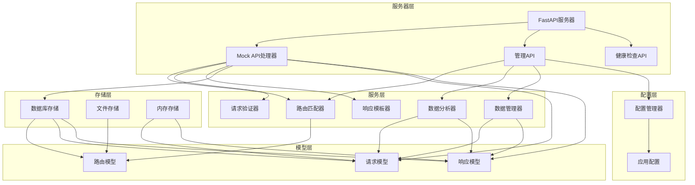

# Mock Server

企业级 Python Mock Server，用于快速创建和管理 API 模拟服务，支持复杂的路由匹配、响应配置、请求验证和数据分析。

## 功能特性

- **智能路由匹配**：支持 RESTful 风格路径、正则表达式、HTTP 方法、头部、查询参数和请求体匹配
- **灵活的响应配置**：支持自定义状态码、响应内容、延迟、随机延迟范围和响应头部
- **请求验证**：支持字段验证、类型验证、范围验证和 JWT 验证
- **响应模板**：支持基于请求上下文的动态响应内容
- **代理模式**：支持将未匹配的请求转发到真实后端服务
- **管理界面**：提供 Web 管理界面，支持路由管理、请求历史查看和数据分析
- **数据持久化**：支持路由配置和请求历史的持久化存储
- **数据分析**：提供请求趋势、响应时间、状态码分布等统计分析
- **多环境支持**：支持配置备份、恢复和环境切换
- **安全认证**：管理界面支持用户认证和授权

## 快速开始

### 安装依赖

```bash
pip install -r requirements.txt
```

### 启动服务

```bash
python main.py
```

服务启动后，您可以访问以下地址：
- **管理界面**：http://localhost:8080/admin
- **健康检查**：http://localhost:8080/health
- **API文档**：http://localhost:8080/docs

## 项目架构

### 核心组件关系



### 模块说明

| 模块 | 主要职责 | 文件位置 | 核心功能 |
|------|---------|----------|----------|
| 配置管理 | 管理应用配置 | app/core/config.py | 服务器配置、管理界面配置、存储配置、代理配置、日志配置 |
| 服务器 | 提供 HTTP 服务 | app/core/server.py | FastAPI 应用实例创建、路由注册、CORS 配置 |
| Mock API | 处理 Mock 请求 | app/api/mock.py | 请求处理、路由匹配、响应生成、请求记录、代理转发 |
| 管理 API | 提供管理功能 | app/api/admin.py | 路由管理、请求历史查看、配置管理、数据分析 |
| 路由管理 | 路由匹配逻辑 | app/services/router.py | 路径匹配、头部匹配、查询参数匹配、请求体匹配 |
| 验证器 | 请求验证 | app/services/validator.py | 字段验证、类型验证、范围验证、JWT 验证 |
| 模板器 | 响应模板渲染 | app/services/templater.py | 基于请求上下文的动态响应内容 |
| 数据分析 | 请求数据分析 | app/services/analytics.py | 请求趋势、响应时间、状态码分布统计 |
| 存储管理 | 数据持久化 | app/storage/ | 数据库存储、文件存储、内存存储 |
| 数据模型 | 数据结构定义 | app/models/ | 路由模型、请求模型、响应模型 |

## 核心功能

### 1. 路由管理

#### 创建路由

**示例：创建一个简单的用户信息 API**

```python
from app.models.route import Route, RouteCreate, RouteMatchRule, RouteResponse

# 创建路由
user_route = Route(
    id="user-info",
    name="用户信息",
    enabled=True,
    match_rule=RouteMatchRule(
        path="/api/users/{id}",
        methods=["GET"],
        headers=None,
        query_params=None,
        body=None,
        use_regex=False
    ),
    response=RouteResponse(
        status_code=200,
        content={"id": "{path.id}", "name": "User {path.id}", "email": "user{path.id}@example.com"},
        headers={"Content-Type": "application/json"},
        delay=0.1,
        delay_range=None,
        content_type="application/json"
    ),
    validator=None,
    tags=["user", "api"],
    created_at=time.time(),
    updated_at=time.time()
)

# 添加路由
from app.api.mock import add_route
add_route(user_route)
```

#### 路由匹配规则

- **路径匹配**：支持 RESTful 风格路径（如 `/api/users/{id}`）和正则表达式
- **HTTP 方法**：支持 GET、POST、PUT、DELETE、PATCH、HEAD、OPTIONS
- **头部匹配**：支持匹配特定的 HTTP 头部
- **查询参数**：支持匹配特定的查询参数
- **请求体**：支持匹配请求体中的特定字段

### 2. 响应配置

#### 基本响应

```python
response = RouteResponse(
    status_code=200,
    content={"message": "Hello from Mock Server"},
    headers={"Content-Type": "application/json"},
    delay=0.0,
    delay_range=None,
    content_type="application/json"
)
```

#### 动态响应

使用模板语法，基于请求上下文生成响应内容：

```python
response = RouteResponse(
    status_code=200,
    content={
        "request_method": "{request.method}",
        "request_path": "{request.path}",
        "query_params": "{query}",
        "path_params": "{path}",
        "client_ip": "{request.client_ip}"
    },
    headers={"Content-Type": "application/json"},
    delay=0.0,
    delay_range=None,
    content_type="application/json"
)
```

#### 延迟配置

```python
# 固定延迟
response = RouteResponse(
    status_code=200,
    content={"message": "Delayed response"},
    headers={"Content-Type": "application/json"},
    delay=1.5,  # 1.5秒延迟
    delay_range=None,
    content_type="application/json"
)

# 随机延迟
response = RouteResponse(
    status_code=200,
    content={"message": "Randomly delayed response"},
    headers={"Content-Type": "application/json"},
    delay=0.0,
    delay_range=[0.5, 2.0],  # 0.5-2.0秒随机延迟
    content_type="application/json"
)
```

### 3. 请求验证

```python
validator = RouteValidator(
    required_fields=["name", "email"],  # 必填字段
    field_types={"age": "integer", "email": "string"},  # 字段类型
    field_ranges={"age": [18, 100]},  # 字段范围
    validate_jwt=False,  # JWT验证
    error_response=RouteResponse(
        status_code=400,
        content={"error": "Validation failed"},
        headers={"Content-Type": "application/json"},
        delay=0.0,
        delay_range=None,
        content_type="application/json"
    )
)
```

### 4. 代理模式

当启用代理模式时，未匹配的请求会被转发到真实的后端服务：

```yaml
# config/default.yaml
proxy:
  enable: true
  target_url: "https://api.example.com"
```

### 5. 管理界面

管理界面提供以下功能：

- **路由管理**：创建、编辑、删除路由
- **请求历史**：查看请求历史记录，支持过滤和搜索
- **数据分析**：查看请求趋势、响应时间、状态码分布等统计信息
- **配置管理**：管理服务配置，支持备份和恢复
- **数据管理**：清理和归档请求数据
  - **归档功能**：自动保存超过保留期限的请求历史，支持按日期分组存储
  - **归档管理**：查看、恢复和删除归档文件
  - **清理策略**：配置最大保留天数、最大记录数和归档选项
  - **自动清理**：定期自动清理和归档过期数据

## API 参考

### Mock API

#### 基本格式

```
GET/POST/PUT/DELETE/PATCH/HEAD/OPTIONS /api/{path}
```

#### 示例

```bash
# 测试默认 API
curl http://localhost:8080/api/test

# 测试带路径参数的 API
curl http://localhost:8080/api/users/123

# 测试带查询参数的 API
curl http://localhost:8080/api/search?query=test

# 测试 POST 请求
curl -X POST http://localhost:8080/api/users \
  -H "Content-Type: application/json" \
  -d '{"name": "John", "email": "john@example.com"}'
```

### 管理 API

#### 路由管理

| 方法 | 路径 | 描述 |
|------|------|------|
| GET | /admin/routes | 获取所有路由 |
| POST | /admin/routes | 新增路由 |
| GET | /admin/routes/{route_id} | 获取指定路由 |
| PUT | /admin/routes/{route_id} | 更新路由 |
| DELETE | /admin/routes/{route_id} | 删除路由 |

#### 请求历史

| 方法 | 路径 | 描述 |
|------|------|------|
| GET | /requests | 获取请求历史 |
| GET | /requests/{request_id} | 获取指定请求详情 |
| DELETE | /requests | 清空请求历史 |

#### 配置管理

| 方法 | 路径 | 描述 |
|------|------|------|
| GET | /config | 获取服务配置 |
| PUT | /config | 更新服务配置 |
| POST | /config/backup | 备份配置 |
| POST | /config/restore | 从备份恢复配置 |
| GET | /config/backups | 获取所有备份 |
| GET | /config/history | 获取配置变更历史 |
| POST | /config/switch | 切换环境 |
| GET | /config/envs | 获取所有环境 |

#### 数据分析

| 方法 | 路径 | 描述 |
|------|------|------|
| GET | /admin/analytics/request-trend | 获取请求趋势 |
| GET | /admin/analytics/response-time | 获取响应时间统计 |
| GET | /admin/analytics/status-codes | 获取状态码统计 |
| GET | /admin/analytics/methods | 获取请求方法统计 |
| GET | /admin/analytics/paths | 获取路径统计 |
| GET | /admin/analytics/summary | 获取汇总统计 |

## 配置说明

### 配置文件

配置文件位于 `config/default.yaml`，支持以下配置项：

```yaml
# 服务器配置
server:
  host: "0.0.0.0"
  port: 8080
  enable_https: false
  https_cert: null
  https_key: null

# 管理界面配置
admin:
  enable: true
  username: "admin"
  password: "password"
  enable_api: true

# 存储配置
storage:
  enable_persistence: true
  config_file: "config/default.yaml"
  db_path: "data/mock_server.db"

# 代理配置
proxy:
  enable: false
  target_url: null

# 日志配置
log:
  level: "INFO"
  file: null  # 日志文件路径，设置后日志会同时输出到文件
```

#### 日志配置说明

**日志级别**：
- `DEBUG`：详细的调试信息
- `INFO`：一般信息，如请求处理、服务启动等
- `WARNING`：警告信息，如请求验证失败等
- `ERROR`：错误信息，如路由添加失败、代理错误等
- `CRITICAL`：严重错误信息

**日志文件配置**：
- 设置 `file` 字段为日志文件路径，例如：`"logs/mock_server.log"`
- 日志目录会自动创建（如果不存在）
- 日志文件格式：`YYYY-MM-DD HH:MM:SS - mock_server - LEVEL - MESSAGE`
- 配置后日志会同时输出到控制台和文件

**示例**：

```yaml
# 配置日志文件
log:
  level: "INFO"
  file: "logs/mock_server.log"
```

这样配置后，日志会输出到 `logs/mock_server.log` 文件中，同时在控制台也会显示。

### 环境变量

支持通过环境变量覆盖配置，格式为 `{SECTION}_{KEY}`，例如：

```bash
# 设置服务器端口
SERVER_PORT=9090 python main.py

# 设置管理界面密码
ADMIN_PASSWORD=secure_password python main.py

# 启用代理模式
PROXY_ENABLE=true PROXY_TARGET_URL=https://api.example.com python main.py
```

## 部署指南

### 开发环境

```bash
# 安装依赖
pip install -r requirements.txt

# 启动服务
python main.py
```

### 生产环境

#### 使用 Gunicorn

```bash
# 安装 Gunicorn
pip install gunicorn

# 启动服务
GUNICORN_CMD_ARGS="--workers=4 --bind=0.0.0.0:8080" gunicorn main:app
```

#### 使用 Docker

```dockerfile
FROM python:3.9-slim

WORKDIR /app

COPY requirements.txt .
RUN pip install --no-cache-dir -r requirements.txt

COPY . .

EXPOSE 8080

CMD ["python", "main.py"]
```

```bash
# 构建镜像
docker build -t mock-server .

# 运行容器
docker run -p 8080:8080 mock-server
```

## 开发者指南

### 项目结构

```
mock_server/
├── app/
│   ├── api/           # API 路由处理器
│   ├── core/          # 核心模块
│   ├── models/        # 数据模型
│   ├── services/      # 业务服务
│   ├── static/        # 静态文件
│   ├── storage/       # 存储实现
│   └── templates/     # HTML 模板
├── config/            # 配置文件
├── data/              # 数据文件
├── tests/             # 测试文件
├── main.py            # 主入口
├── requirements.txt   # 依赖文件
└── README.md          # 项目文档
```

### 代码规范

- **缩进**：4 空格
- **行宽**：88 字符（符合 Black 标准）
- **导入顺序**：标准库 → 第三方库 → 本地模块
- **注释**：Google 风格文档字符串
- **命名规范**：
  - 类名：CapWords
  - 函数/变量：snake_case
  - 常量：UPPER_CASE
  - 私有成员：单下划线前缀

### 测试

```bash
# 运行所有测试
pytest

# 运行特定测试文件
pytest tests/test_mock.py

# 查看测试覆盖率
pytest --cov=app
```

### 代码质量

```bash
# 运行 lint 检查
pylint app/

# 运行类型检查
mypy app/

# 格式化代码
black app/
```

## 故障排除

### 常见问题

1. **服务启动失败**
   - 检查端口是否被占用
   - 检查依赖是否正确安装
   - 检查配置文件是否正确

2. **路由匹配失败**
   - 检查 HTTP 方法是否正确
   - 检查路径是否匹配
   - 检查头部、查询参数和请求体是否符合匹配规则

3. **代理请求失败**
   - 检查目标 URL 是否可访问
   - 检查网络连接是否正常
   - 检查目标服务是否正常运行

4. **管理界面无法访问**
   - 检查管理界面是否启用
   - 检查用户名和密码是否正确
   - 检查浏览器缓存

### 日志查看

默认日志输出到控制台，可通过配置文件设置日志文件：

```yaml
log:
  level: "INFO"
  file: "logs/mock_server.log"
```

### 数据恢复

如果服务数据损坏，可以从备份恢复：

1. 通过管理界面上传备份文件并恢复
2. 或手动将备份文件复制到 `config/backups/` 目录，然后通过 API 恢复

## 贡献指南

1. **Fork 项目**
2. **创建特性分支** (`git checkout -b feature/amazing-feature`)
3. **提交更改** (`git commit -m 'Add some amazing feature'`)
4. **推送到分支** (`git push origin feature/amazing-feature`)
5. **创建 Pull Request**

## 许可证

MIT License

## 联系方式

- **项目地址**：https://github.com/yourusername/mock-server
- **问题反馈**：https://github.com/yourusername/mock-server/issues

---

**注意**：本项目仅用于开发和测试环境，不建议在生产环境中使用。
